+++
# A Demo section created with the Blank widget.
# Any elements can be added in the body: https://sourcethemes.com/academic/docs/writing-markdown-latex/
# Add more sections by duplicating this file and customizing to your requirements.

widget = "blank"  # See https://sourcethemes.com/academic/docs/page-builder/
headless = true  # This file represents a page section.
active = true  # Activate this widget? true/false
weight = 15  # Order that this section will appear.

# title = "Demos"
# subtitle = ""

[design]
  # Choose how many columns the section has. Valid values: 1 or 2.
  columns = "1"

[design.background]
  # Apply a background color, gradient, or image.
  #   Uncomment (by removing `#`) an option to apply it.
  #   Choose a light or dark text color by setting `text_color_light`.
  #   Any HTML color name or Hex value is valid.

  # Background color.
  # color = "navy"

  # Background gradient.
  # gradient_start = "DeepSkyBlue"
  # gradient_end = "SkyBlue"

  # Background image.
  # image = "headers/bubbles-wide.jpg"  # Name of image in `static/img/`.
  # image_darken = 0.6  # Darken the image? Range 0-1 where 0 is transparent and 1 is opaque.
  # image_size = "cover"  #  Options are `cover` (default), `contain`, or `actual` size.
  # image_position = "center"  # Options include `left`, `center` (default), or `right`.
  # image_parallax = true  # Use a fun parallax-like fixed background effect? true/false

  # Text color (true=light or false=dark).
  # text_color_light = true

[design.spacing]
  # Customize the section spacing. Order is top, right, bottom, left.
  padding = ["0px", "0", "0px", "0"]

[advanced]
 # Custom CSS. 
 css_style = ""

 # CSS class.
 css_class = ""

+++

<figure style="margin: 0">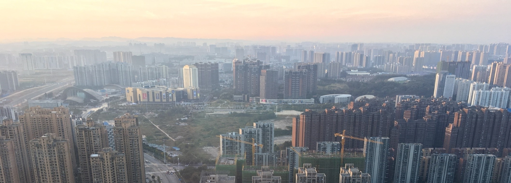<figcaption style="text-align: right;">Beijing, China</figcaption></figure>

# China Recommendations

For anyone who wants to learn a bit more about China but doesn't know where to start, I've put together a few recommendations for books, movies, and other resources.

Jump to:
* <a href="#books" style="color:black">Books</a>
* <a href="#movies" style="color:black">Movies</a>
* <a href="#podcasts" style="color:black">Podcasts</a>
* <a href="#online" style="color:black">Online Resources</a>

&nbsp;  

## <a name="books">Books</a>

|                                                              |                                                              |
| ------------------------------------------------------------ | ------------------------------------------------------------ |
| 
<a href="https://www.hup.harvard.edu/catalog.php?isbn=9780674725867" target="_blank">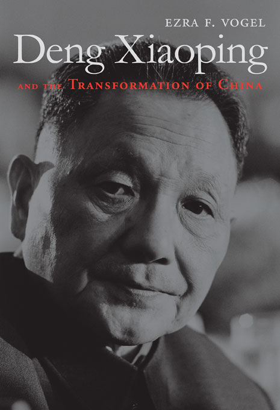</a>
 | <a href="https://www.hup.harvard.edu/catalog.php?isbn=9780674725867" target="_blank" style="color:black"><h3>Deng Xiaoping and the Transformation of China</h3></a>
By Ezra Vogel (2011)  This biography of Deng Xiaoping offers one of the best accounts of China's economic and political transformation in the 1980s and 1990s. |
| <a href="https://www.penguinrandomhouse.com/books/26101/factory-girls-by-leslie-t-chang/" target="_blank">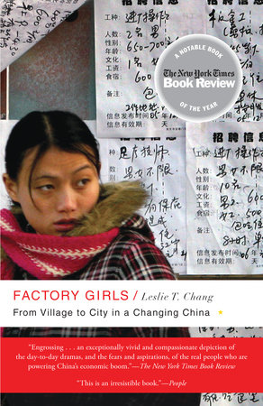</a> | <a href="https://www.penguinrandomhouse.com/books/26101/factory-girls-by-leslie-t-chang/" target="_blank" style="color:black"><h3>Factory Girls: From Village to City in a Changing China</h3></a>
By Leslie Chang (2009)  If you're interested in understanding more about the lives and aspirations of the factory workers behind the "Made in China" label, this book based on extensive interviews with young women working in southern China offers one of the best accounts. |
| <a href="https://www.penguinrandomhouse.com/books/161758/wealth-and-power-by-orville-schell-and-john-delury/" target="_blank">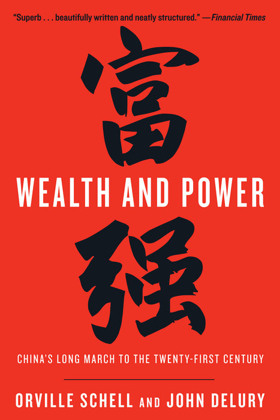 | <a href="https://www.penguinrandomhouse.com/books/161758/wealth-and-power-by-orville-schell-and-john-delury/" target="_blank" style="color:black"><h3>Wealth and Power: China's Long March to the Twenty-First Century</h3></a>
By Orville Schell and John Delury (2013)  A single powerful national narrative dominates in China: the world's greatest civilization humiliated by a century of foreign incursions finally returning to its rightful place as a global superpower. This book offers the best account of this narrative and how it fundamentally shapes the actions of the CCP leadership today. |
| <a href="https://www.penguinrandomhouse.com/books/204464/china-in-ten-words-by-yu-hua-translated-by-allan-h-barr/" target="_blank">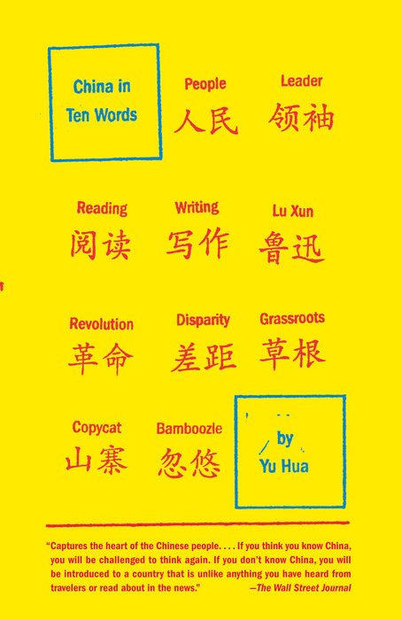 | <a href="https://www.penguinrandomhouse.com/books/204464/china-in-ten-words-by-yu-hua-translated-by-allan-h-barr/" target="_blank" style="color:black"><h3>China in Ten Words</h3></a>
By Yu Hua (2010)  This short nonfiction book by one of China's most famous novelists offers a glimpse into the lived experiences of several formative episodes in the country's recent history, including the Cultural Revolution and Tiananmen Square. |
| <a href="https://www.harpercollins.com/9780061998089/the-party/" target="_blank">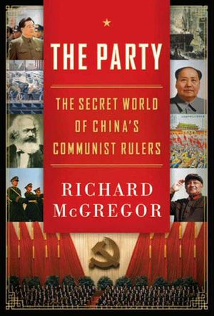 | <a href="https://www.harpercollins.com/9780061998089/the-party/" target="_blank" style="color:black"><h3>The Party: The Secret World of China's Communist Rulers</h3></a>
By Richard McGregor (2010)  This is probably the single best book for anyone who wants to understand how the Chinese Communist Party works today. |

&nbsp;  
## <a name="movies">Movies</a>

|                                                              |                                                              |
| ------------------------------------------------------------ | ------------------------------------------------------------ |
| 
<a href="https://www.imdb.com/title/tt4056808/" target="_blank">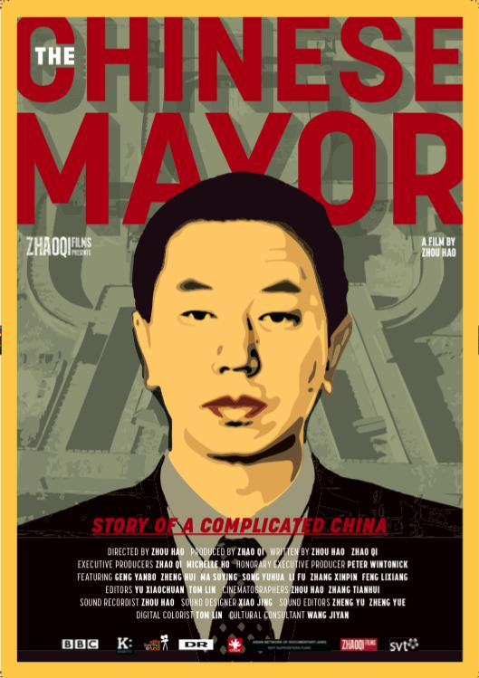</a>
 | <a href="https://www.imdb.com/title/tt4056808/" target="_blank" style="color:black"><h3>The Chinese Mayor (2015)</h3></a>
An incredible documentary that follows the mayor of a Chinese city as he tries to launch an urban revitalization program and deals with grievances from local residents. |
| <a href="https://www.imdb.com/title/tt1512201/" target="_blank">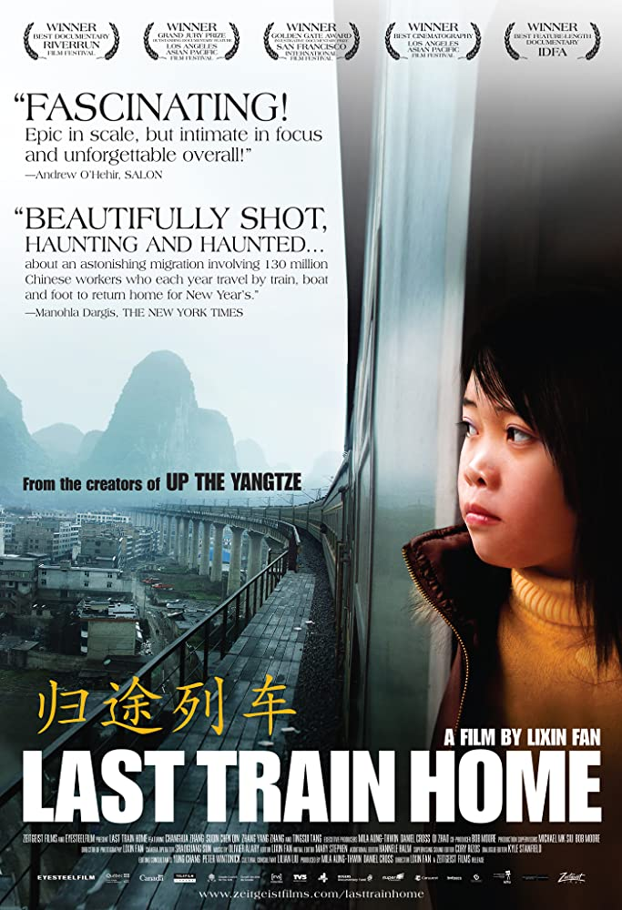</a> | <a href="https://www.imdb.com/title/tt1512201/" target="_blank" style="color:black"><h3>Last Train Home (2009)</h3></a>
A moving documentary about the yearly return of millions of migrant workers by train during Chinese New Year. This movie shows the chaos and frustration of this annual ritual before China built its modern high-speed rail network as well as the inner turmoil within families over how to adapt to a rapidly changing economy. |
| <a href="https://www.imdb.com/title/tt5039856/" target="_blank">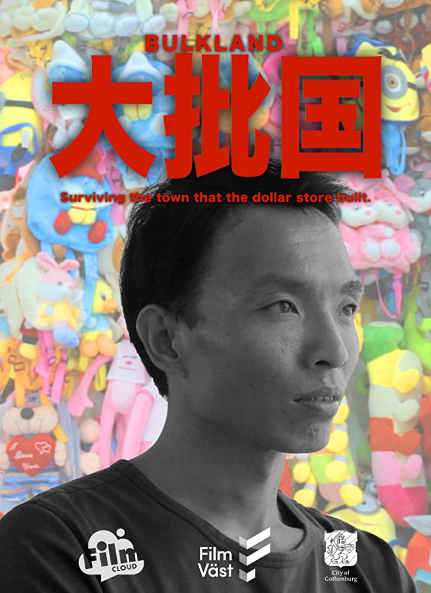 | <a href="https://www.imdb.com/title/tt5039856/" target="_blank" style="color:black"><h3>Bulkland (2017)</h3></a>
A great hour-long documentary about the famous commercial town of Yiwu where Chinese wholesalers market their goods to international buyers. This short film offers a glimpse into the world behind the "Made in China" label. |
| <a href="https://www.imdb.com/title/tt0113147/" target="_blank">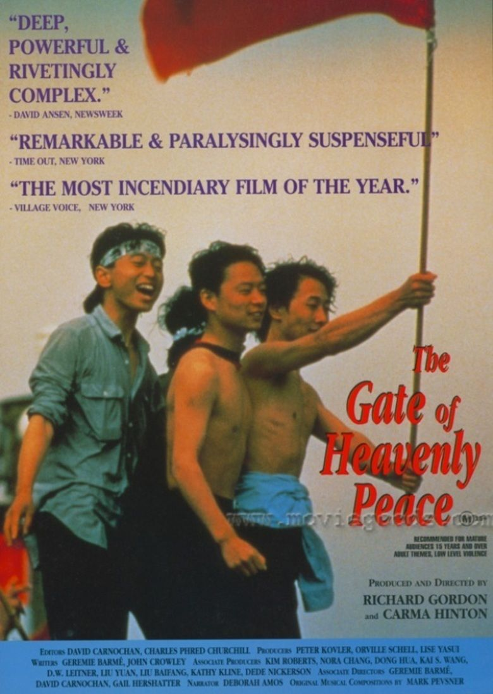 | <a href="https://www.imdb.com/title/tt0113147/" target="_blank" style="color:black"><h3>The Gate of Heavenly Peace</h3></a>
This three-hour PBS Frontline documentary about the 1989 Tiananmen Square protests offers the best single portrait of this famous event. This movie does a great job of showing how the Tiananmen protests evolved and the interesting personal dynamics within the movement. |
| <a href="https://www.imdb.com/title/tt9351980/" target="_blank">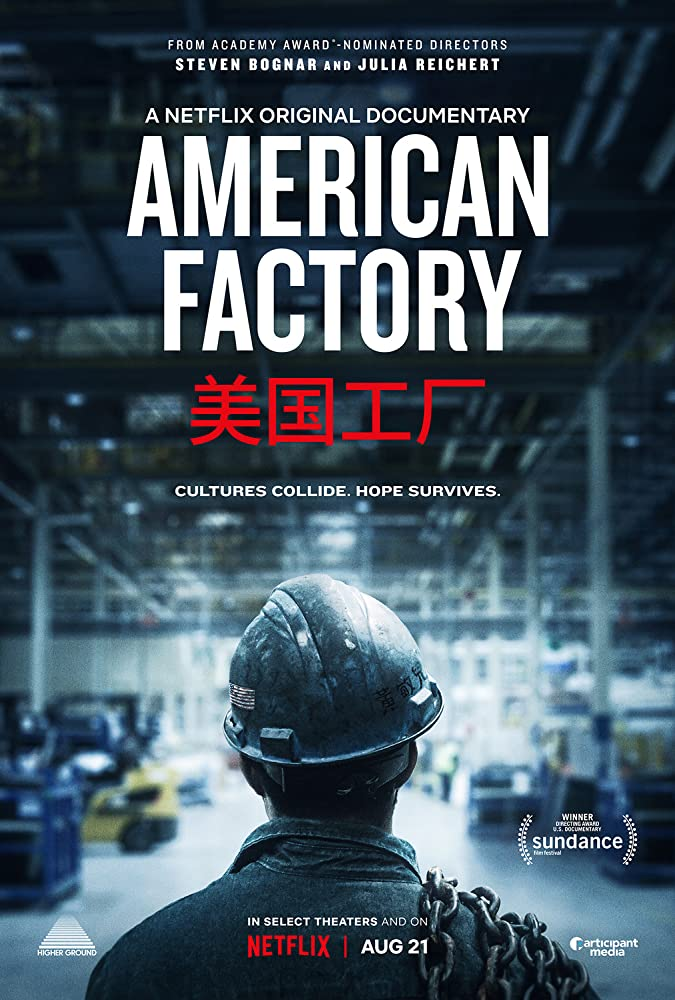 | <a href="https://www.imdb.com/title/tt9351980/" target="_blank" style="color:black"><h3>American Factory (2019)</h3></a>
This two-hour documentary backed by Obama's production company tells the story of a new Chinese factory that opened in a shuttered GM plant in Ohio. The often comical culture clash between the Chinese and American workers says much about the broader challenges to mutual understanding between the two countries. The film won an Oscar for best feature documentary. |

&nbsp;  
## <a name="podcasts">Podcasts</a>

|                                                              |                                                              |
| ------------------------------------------------------------ | ------------------------------------------------------------ |
| 
<a href="https://supchina.com/series/sinica/" target="_blank">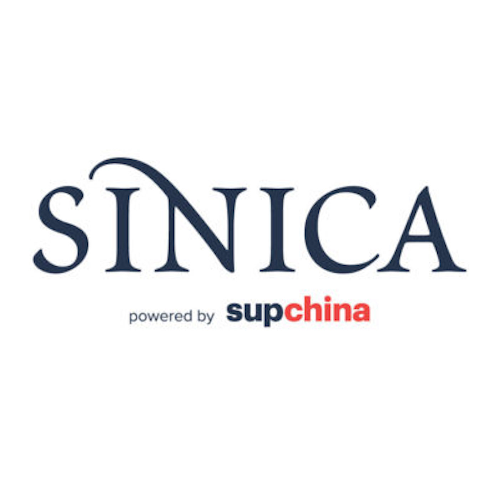</a>
 | <a href="https://supchina.com/series/sinica/" target="_blank" style="color:black"><h3>Sinica</h3></a>
This conversational podcast is the go-to podcast on China today, covering a wide range of important cultura, political, and economic issues through interviews with journalists and researchers. |
| <a href="https://supchina.com/series/china-econtalk/" target="_blank">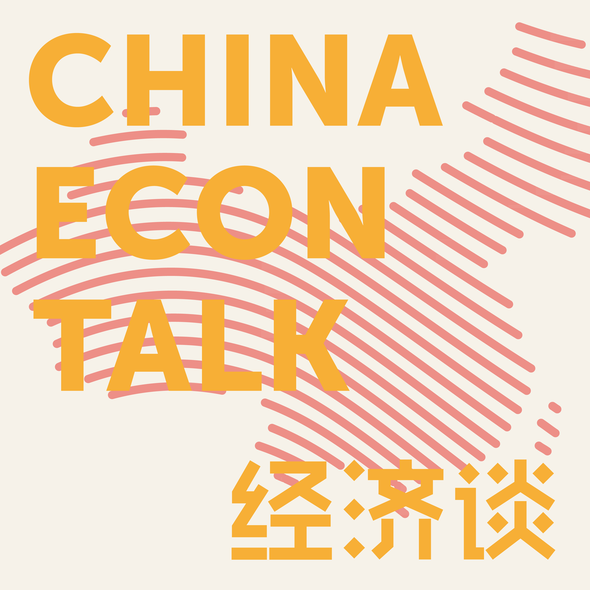</a> | <a href="https://supchina.com/series/china-econtalk/" target="_blank" style="color:black"><h3>China EconTalk</h3></a>
Also a great conversational podcast focused on tech and economic issues in China. |
| <a href="https://cscc.sas.upenn.edu/podcasts" target="_blank">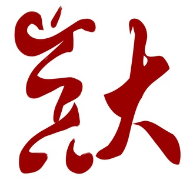 | <a href="https://cscc.sas.upenn.edu/podcasts" target="_blank" style="color:black"><h3>UPenn Center for the Study of Contemporary China Podcast</h3></a>
The best China podcast run by an academic institution featuring interviews and lectures with established China scholars. |
| <a href="https://chinaafricaproject.com/category/podcast/" target="_blank">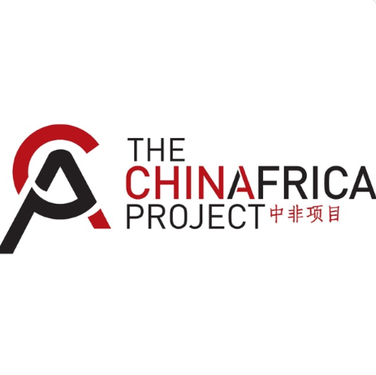 | <a href="https://chinaafricaproject.com/category/podcast/" target="_blank" style="color:black"><h3>China in Africa</h3></a>
I regularly listen to this conversational podcast focused on China's growing involvement in Africa. The podcast includes interviews with many Chinese and African journalists and researchers. |

&nbsp;  
## <a name="online">Online Resources</a>

|                                                              |                                                              |
| ------------------------------------------------------------ | ------------------------------------------------------------ |
| 
  
 | <a href="https://www.scmp.com/" target="_blank" style="color:black"><h3>South China Morning Post</h3></a>
This established Hong Kong-based newspaper is the single best source for English-language news about China. Owned by Chinese tech company Alibaba, this newspaper is relatively unbiased in its coverage of news about mainland China. All of its articles are free online. |
| <a href="https://www.caixinglobal.com/" target="_blank">  </a> | <a href="https://www.caixinglobal.com/" target="_blank" style="color:black"><h3>Caixin</h3></a>
This mainland-based online news organization generally focuses on financial and business news but is famous for incredible investigative reporting on politically sensitive issues. Caixin offers English-language versions of its daily news articles and its weekly news magazine Caixin Weekly.  |
| <a href="http://www.sixthtone.com/" target="_blank">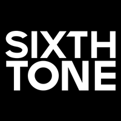 | <a href="http://www.sixthtone.com/" target="_blank" style="color:black"><h3>Sixth Tone</h3></a>
 A Shanghai-based media organization that offers deeper perspectives on life and trends in China. |