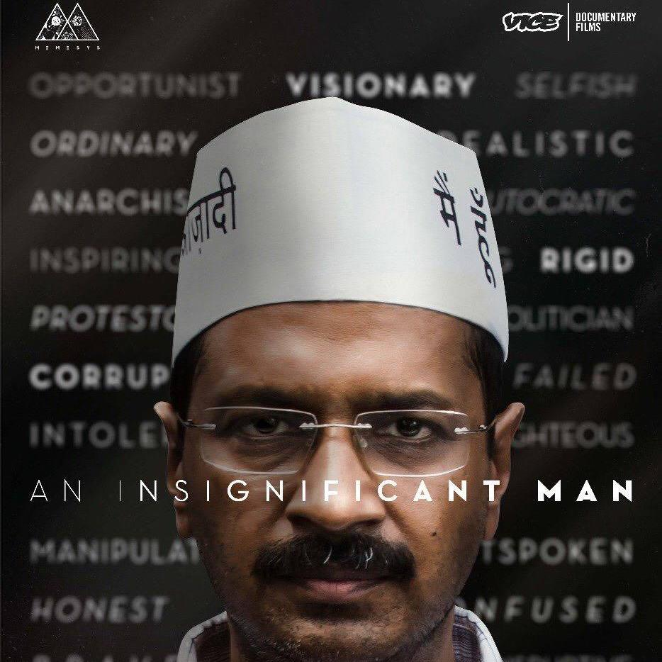

+++
# A Demo section created with the Blank widget.
# Any elements can be added in the body: https://sourcethemes.com/academic/docs/writing-markdown-latex/
# Add more sections by duplicating this file and customizing to your requirements.

widget = "blank"  # See https://sourcethemes.com/academic/docs/page-builder/
headless = true  # This file represents a page section.
active = true  # Activate this widget? true/false
weight = 15  # Order that this section will appear.

# title = "Demos"
# subtitle = ""

[design]
  # Choose how many columns the section has. Valid values: 1 or 2.
  columns = "1"

[design.background]
  # Apply a background color, gradient, or image.
  #   Uncomment (by removing `#`) an option to apply it.
  #   Choose a light or dark text color by setting `text_color_light`.
  #   Any HTML color name or Hex value is valid.

  # Background color.
  # color = "navy"

  # Background gradient.
  # gradient_start = "DeepSkyBlue"
  # gradient_end = "SkyBlue"

  # Background image.
  # image = "headers/bubbles-wide.jpg"  # Name of image in `static/img/`.
  # image_darken = 0.6  # Darken the image? Range 0-1 where 0 is transparent and 1 is opaque.
  # image_size = "cover"  #  Options are `cover` (default), `contain`, or `actual` size.
  # image_position = "center"  # Options include `left`, `center` (default), or `right`.
  # image_parallax = true  # Use a fun parallax-like fixed background effect? true/false

  # Text color (true=light or false=dark).
  # text_color_light = true

[design.spacing]
  # Customize the section spacing. Order is top, right, bottom, left.
  padding = ["0px", "0", "0px", "0"]

[advanced]
 # Custom CSS. 
 css_style = ""

 # CSS class.
 css_class = ""

+++

<figure style="margin: 0"><figcaption style="text-align: right;">Lodhi Gardens (Delhi, India)</figcaption></figure>

# India Recommendations

For anyone who wants to learn a bit more about India but doesn't know where to start, I've put together a few recommendations for books, movies, and other resources.

Jump to:
* <a href="#books" style="color:black">Books</a>
* <a href="#movies" style="color:black">Movies</a>
* <a href="#podcasts" style="color:black">Podcasts</a>
* <a href="#online" style="color:black">Online Resources</a>

&nbsp;  

## <a name="books">Books</a>

|                                                              |                                                              |
| ------------------------------------------------------------ | ------------------------------------------------------------ |
| 

 | <a href="https://www.penguinrandomhouse.com/books/104258/in-spite-of-the-gods-by-edward-luce/" target="_blank" style="color:black"><h3>In Spite of the Gods: The Rise of Modern India</h3></a>
By Edward Luce (2004)  My favorite general introduction to the country from the former South Asia bureau chief for the Financial Times. |
|  | <a href="https://www.penguinrandomhouse.com/books/36931/india-unbound-by-gurcharan-das/" target="_blank" style="color:black"><h3>India Unbound: The Social and Economic Revolution from Independence to the Global Information Age</h3></a>
By Gucharan Das (2000)  One of my earliest and most eye-opening introductions to the country from a well-known writer and columnist who was once served as the head of Procter & Gamble India. |
| <a href="https://www.penguinrandomhouse.com/books/112973/maximum-city-by-suketu-mehta/" target="_blank"> | <a href="https://www.penguinrandomhouse.com/books/112973/maximum-city-by-suketu-mehta/" target="_blank" style="color:black"><h3>Maximum City: Bombay Lost and Found</h3></a>
By Suketu Mehta (2004)  An incredible account of Mumbai's underworld including the nexus of Bollywood and organized crime. |
| <a href="https://press.princeton.edu/books/hardcover/9780691160795/an-uncertain-glory" target="_blank"> | <a href="https://press.princeton.edu/books/hardcover/9780691160795/an-uncertain-glory" target="_blank" style="color:black"><h3>An Uncertain Glory: India and Its Contradictions</h3></a>
By Jean Dreze and Amartya Sen (2013)  If I had to choose one book to recommend on economic and development issues in India, it would be this one by two of the most famous economists who work on India. This book offers a harsh but honest assessment of India's most pressing development challenges, particularly infrastructure and public health. |
| <a href="https://www.penguinrandomhouse.com/books/554196/the-billionaire-raj-by-james-crabtree/" target="_blank"> | <a href="https://www.penguinrandomhouse.com/books/554196/the-billionaire-raj-by-james-crabtree/" target="_blank" style="color:black"><h3>The Billioinaire Raj: A Journey Through India's New Gilded Age</h3></a>
By James Crabtree (2018)  One of the best portraits of India's fabled industrialists by the former Mumbai bureau chief for the Financial Times. This book also provides an excellent summary of the many paradoxes of the India's political and economic system. |
| <a href="https://yalebooks.yale.edu/book/9780300216202/when-crime-pays" target="_blank"> | <a href="https://yalebooks.yale.edu/book/9780300216202/when-crime-pays" target="_blank" style="color:black"><h3>When Crime Pays: Money and Muscle in Indian Politics</h3></a>
By Milan Vaishnav (2017)  The best single book on India's political economy, tying together elections, corruption, and organized crime. This book does the best job of addressing the biggest question I've had about the country: why does India's democratic system so often fail to provide basic public goods and servcies?  |

&nbsp;  
## <a name="movies">Movies</a>

|                                                              |                                                              |
| ------------------------------------------------------------ | ------------------------------------------------------------ |
| 

 | <a href="https://en.wikipedia.org/wiki/Katiyabaaz" target="_blank" style="color:black"><h3>Powerless (Hindi: Katiyabaaz) (2013)</h3></a>
An incredibly eye-opening documentary about a "power thief" who helps local residents set up illegal connections to the electric grid. The challenges these local residents face in getting electricity, the many moral nuances of such actions, and their willingness to improvise and use any means necessary to get electricity are emblematic of India's broader challenges and strategies for coping.  |
|  | <a href="https://www.imdb.com/title/tt5764096/" target="_blank" style="color:black"><h3>Hindi Medium (2017)</h3></a>
This fictional film about the often comical efforts of two parents to get their son into a good school touches on many of the challenges and hopes that Indian families face from navigating Kafkaesque bureaucracies to the sacrifices parents make to secure a better future for their children.  |
| <a href="https://www.imdb.com/title/tt3917908/" target="_blank"> | <a href="https://www.imdb.com/title/tt3917908/" target="_blank" style="color:black"><h3>An Insignificant Man (2017)</h3></a>
A fascinating documentary that offers a behind-the-scenes look inside a political party in Delhi and its leader, Arvind Kejriwal, who was a major figure in India's 2011 anti-corruption protests.  |
| <a href="https://www.imdb.com/title/tt4058426/" target="_blank"> | <a href="https://www.imdb.com/title/tt4058426/" target="_blank" style="color:black"><h3>India's Daughter (2015)</h3></a>
A documentary about the 2012 Delhi gang rape that made international headlines. The filmmakers interviewed the men themselves, and their explanations for why they carried out this act reveal a tremendous amount about class, education, gender attitudes, and the violent policing of social norms in India.  |
| <a href="https://www.imdb.com/title/tt5312232/?ref_=tt_urv" target="_blank"> | <a href="https://www.imdb.com/title/tt5312232/?ref_=tt_urv" target="_blank" style="color:black"><h3>Sairat (2016)</h3></a>
This amazing fictional feature film about caste, family, and marriage says more about these subjects than a library shelf of academic books. |

&nbsp;  
## <a name="podcasts">Podcasts</a>

|                                                              |                                                              |
| ------------------------------------------------------------ | ------------------------------------------------------------ |
| 

 | <a href="https://carnegieendowment.org/grandtamasha/" target="_blank" style="color:black"><h3>Grand Tamasha</h3></a>
My favorite podcast about India hosted by Milan Vaishnav, author of When Crime Pays and a senior fellow at the Carnegie Endowment. |
|  | <a href="https://seenunseen.in/" target="_blank" style="color:black"><h3>The Seen and the Unseen with Amit Varma</h3></a>
One of the best and most popular podcasts about Indian politics and society. |
| <a href="https://ivmpodcasts.com/ganatantra" target="_blank"> | <a href="https://ivmpodcasts.com/ganatantra" target="_blank" style="color:black"><h3>Ganatantra</h3></a>
Another great podcast about Indian politics. One of best features of this podcast is its attention to politics within Indian states rather than just Delhi political intrigue. |

&nbsp;  
## <a name="online">Online Resources</a>

|                                                              |                                                              |
| ------------------------------------------------------------ | ------------------------------------------------------------ |
| 
 
 | <a href="https://caravanmagazine.in/" target="_blank" style="color:black"><h3>The Caravan</h3></a>
One of India's finest online magazines with great in-depth coverage of major political and social issues.  |
| <a href="https://thewire.in/" target="_blank"> </a> | <a href="https://thewire.in/" target="_blank" style="color:black"><h3>The Wire</h3></a>
Another great online source for news and analysis.  |
| <a href="https://www.hindustantimes.com/" target="_blank"> | <a href="https://www.hindustantimes.com/" target="_blank" style="color:black"><h3>Hindustan Times</h3></a>
 One of the most widely read English-language naitonal daily newspapers in India and my primary source for general news. |
| <a href="https://www.livemint.com/" target="_blank">  | <a href="https://www.livemint.com/" target="_blank" style="color:black"><h3>Mint</h3></a>
An online news publication that provides excellent coverage and analysis for business and financial news. |