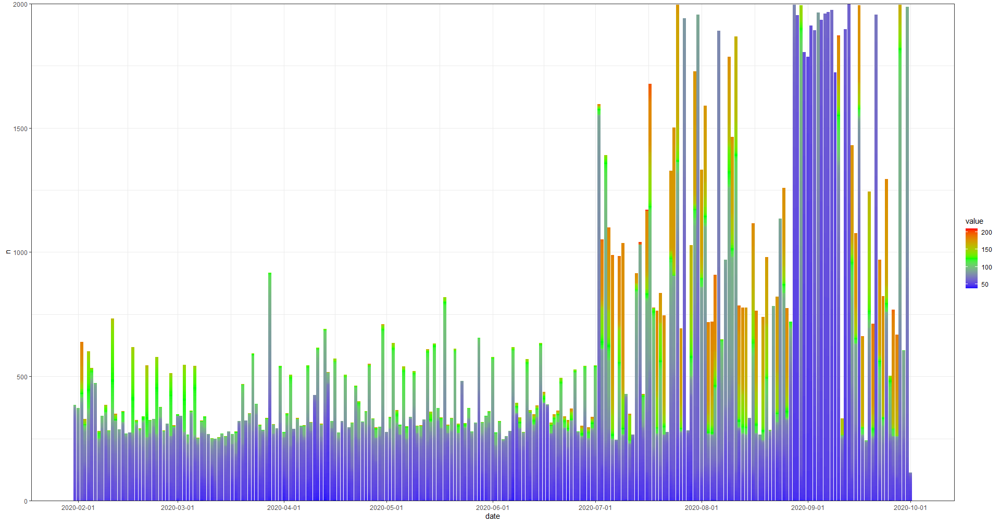
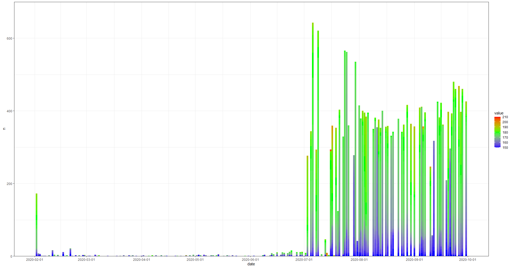
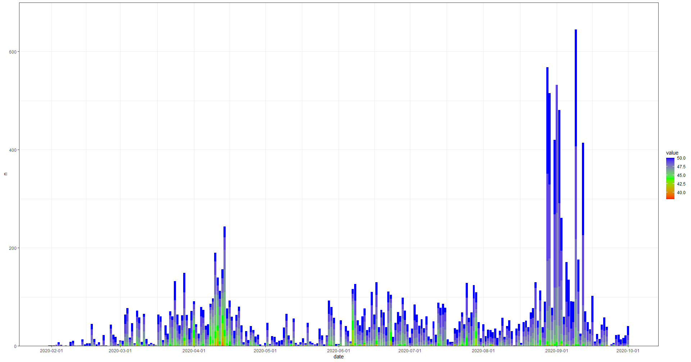
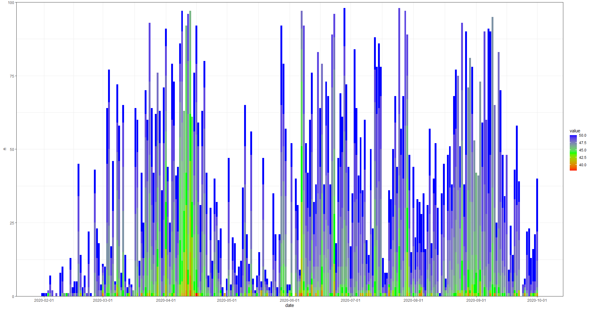

# <a name="intro">Introduction</a>

If you have an Apple Watch, your heart rate (HR) is being recorded at various times throughout the day in beats per minute (bpm). If you want a quick way to look at your HR data on your iPhone, I recommend the free Cardiogram app. But if you want to analyze your HR data on your computer, you'll need to go through a few more steps.


# Step 1: Export your Apple Health data

On your iPhone, open the Health app. This app comes pre-installed on your iPhone.

From the Summary page, go to your account info (tap the circle icon in the top-right corner with your initials in it). Scroll down to the bottom and tap "Export All Health Data." You can email the file to yourself as an attachment or save it to a cloud storage service like Dropbox.

On your computer, unzip the "export.zip" file. Note that the full file size may end up being quite large, even more than 1 GB. Within the unzipped "export" folder, you'll find another folder called "apple_health_export". Move this folder to a place on your computer where you'd like to save your data. Later, you'll set this as your working directory.

# Step 2: Use R to Load the XML File

Apple Health data is stored in an XML file called "export.xml". You won't be able to read this using Excel, but R will allow us to load the XML file and convert it to a usable data table.

In R, load the following libraries:
```
library(XML)
library(tidyverse)
library(lubridate)
library(scales)
library(ggthemes)
```

Set your working directory to the folder where your "export.xml" file is saved. Be sure to replace backslashes "\\\" with forward slashes "/":
```
setwd("C:/Users/YourName/Documents/apple_health_data")
```

Load the XML file in R:
```
xml <- xmlParse('export.xml')
```

Extract the actual records from the XML file:
```
df_record <- XML:::xmlAttrsToDataFrame(xml["//Record"])
```

Clean up some of the variables, like the device name:
```
df <- df_record %>%
  mutate(device = gsub(".*(name:)|,.*", "",device),
         value = as.numeric(as.character(value)),
         type = str_remove(type, "HKQuantityTypeIdentifier"))
```
(Note: this code comes from https://taraskaduk.com/posts/2019-03-23-apple-health/)

Now you have a workable data table with your Apple Health data. This includes every type of health data you've ever recorded, such as weight, stepcount, etc.

Now let's extract the HR data:
```
hr <- df %>%
  filter(type == "HeartRate") %>%
  filter(device == "Apple Watch") %>%
  mutate(datetime = as_datetime(startDate)) %>% # datetime is combined date and time
  mutate(date = as.Date(datetime)) %>% # date is just date from datetime
  mutate(time = format(datetime, "%H:%M:%S")) %>% # time is just time from datetime
  mutate(value = as.integer(value)) %>% # value is the actual heart rate reading
  select(c(datetime, date, time, value))
```
Now we have a new data table called "hr" that includes only HR data that was recorded with your Apple Watch (as opposed to HR data recorded with other devices). We've also cleaned up some of the data and created separate variables for date, time, and combined date & time. Finally, we've dropped all other variables so that we just have our HR data (labeled "value") and the corresponding date and time of the HR recording. If you look at the data table itself, you'll see we have 4 variables ("datetime", "date", "time", "value") with a row for each HR reading. Depending on how long you've had your Apple Watch and other factors, you may have over a hundred thousand rows of individual HR values.

**A Word about Apple's HR Data Format**

Your Apple Watch does not take HR readings at set time intervals, like once a minute. Instead, it takes HR readings more frequently when it knows you're engaged in some kind of activity like exercise and fewer HR readings when you're not moving around much. During exercise, your Apple Watch may take an HR reading as often as as once per second. But when you're not moving around much, your Apple Watch may take an HR reading as infrequently as once every few minutes.

Because the frequency of HR readings varies over time, it can be tricky to analyze the HR data. We can't just look at the percentage of readings above or below a certain BPM level for each day. If you exercised that day, your Apple Watch may have taken hundreds of extra HR readings during that exercise session, which would skew the proportions of your HR values. For now, I've decided to focus on absolute counts of specific HR values, like the number of HR readings each day that are 50 bpm.

# Step 3: Visualizing Apple Watch HR Data in R
Let's first reformat the data in terms of days so that we have a time series:
```
hr_spread <- hr %>%
  group_by(date, value) %>%
  tally()
```
This gives us a new data table "hr_spread" with 3 variables: date, HR value, and n. This shows us for each date and for each HR value (like 47 bpm or 60 bpm), how many of that HR value do we have. For example, a row might show that on January 1, 2020 for the HR value of 50 bpm, we had a count of 10 readings that were 50 bpm.

Now we can plot this as a stacked bar chart of HR values per date:
```
windows()
hr_spread %>%
  ggplot(aes(y=n, x=date)) + 
  geom_bar(position="stack", stat="identity", aes(fill=value)) +
  scale_y_continuous(limits=c(0,2000), expand = c(0, 0)) +
  scale_x_date(date_breaks = "1 month") +
  theme_bw() +
  scale_fill_gradientn(colours = rev(rainbow(3)))
```
The first line `windows()` just makes the plot open in a separate window so we can maximize it. I've included limits on the y-axis just so that the graph doesn't look so zoomed out. I've also made sure that the plot starts at 0 by including `expand = c(0, 0)`. Lastly, I've colored the plot using one of the rainbow color palettes in ggplot.



Each bar is one day's worth of HR readings. The height of each bar is the number of HR readings for that day. The colors represent the HR values in bpm. As you can see from the legend on the right, blue is for HR readings around 50 bpm, green is for HR readings around 100 bpm, and yellow and red are for HR readings around 150 bpm and above. You can see that the vast majority of my HR values are under 70 bpm. These also include HR readings when I'm sleeping, which are almost all well under 70 bpm. But you can also see a bit of yellow and even red, indicated times when I exercised.

There's a sudden surge in the total number of HR readings in the high range from around July. That's because I run regularly but didn't start recording my runs with my Apple Watch until July. There's also a surge in blue HR readings in September. That's when I began using the "yoga" activity function on my Apple Watch not to record an actual yoga session but to force my Apple Watch to take more frequent HR readings.

Let's zoom in on some of the data. Let's focus on only HR readings that are 150 bpm and above. We use `filter` in dplyr to only include HR values at or above our 150 bpm threshold:
```
hr_spread <- hr %>%
  group_by(date, value) %>%
  tally() %>%
  filter(value >= 150)
  ```

We can tweak the y-axis of the plot so that it fills up most of the plot area without getting truncated by setting `limits=c(0,700)`:
```
windows()
hr_spread %>%
  ggplot(aes(y=n, x=date)) + 
  geom_bar(position="stack", stat="identity", aes(fill=value)) +
  scale_y_continuous(limits=c(0,700), expand = c(0, 0)) +
  scale_x_date(date_breaks = "1 month") +
  theme_bw() +
  scale_fill_gradientn(colours = rev(rainbow(3)))
```


We can clearly see when I started recording my runs with my Apple Watch. Some of my peak HR values even approach 200 bpm, which shows up in red.

Now let's focus on only HR readings that are 50 bpm and below, which is very low. Again, we use `filter` in dplyr to only include HR values at or below our 50 bpm threshold:
```
hr_spread <- hr %>%
  group_by(date, value) %>%
  tally() %>%
  filter(value <= 50)
  ```

Again, when we plot, we can adjust the y-axis limits to make everything fit better. I've also reversed the coloring so that readings that are low (around 40 bpm) are red and one that are high (around 50 bpm) are blue:
```
windows()
hr_spread %>%
  ggplot(aes(y=n, x=date)) + 
  geom_bar(position="stack", stat="identity", aes(fill=value)) +
  scale_y_continuous(limits=c(0,700), expand = c(0, 0)) +
  scale_x_date(date_breaks = "1 month") +
  theme_bw() +
  scale_fill_gradientn(colours = rainbow(3))
```



We can even zoom in further by setting the max value of y-axis to 100 instead of 700. This will truncate some of the taller bars but will give us a better view of the detail for the lower HR values.
```
windows()
hr_spread %>%
  ggplot(aes(y=n, x=date)) + 
  geom_bar(position="stack", stat="identity", aes(fill=value)) +
  scale_y_continuous(limits=c(0,100), expand = c(0, 0)) +
  scale_x_date(date_breaks = "1 month") +
  theme_bw() +
  scale_fill_gradientn(colours = rainbow(3))
```



We've now done some simple analysis of HR data collected by our Apple Watch in R. We now also have a workable data table with our HR values for each day to examine trends over time. Now that we know how to convert our Apple Health XML data file into a data table in R, we can also look at other types of data, like specific workouts.