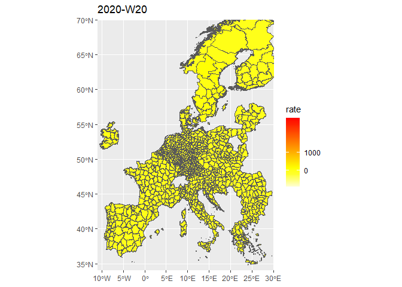

# Introduction

**Project goal**  
Create an animated map of COVID cases in the EU by region
(i.e. subnational level). I focus on the regional level in particular
because the national level data is too coarse and I was curious whether
there might be interesting regional patterns that span national borders.

**Data sources**  
1. GISCO map data  
2. ECDC COVID data

**Key challenges**  
Dealing with differing NUTS levels. ECDC’s COVID data is sometimes
reported at the NUTS1 or NUTS2 or NUTS3 level, probably depending on how
each country reports their own COVID data. The trick is to apply the
lowest level NUTS data possible to the map. Sometimes we don’t have
NUTS3 data for a given country, but we can use the NUTS2 data to fill in
at the NUTS3 level.

    library(stats)
    library(sf) # Map data
    library(tidyverse)
    library(giscoR) # GISCO is the Eurostat agency that deals with geographical data
    library(readxl) # Importing Excel files
    library(gganimate) # Animate ggplot
    library(transformr) # For maps in R
    library(av) # Allow you to create video file rather than GIF

    setwd("C:/Users/kylei/Dropbox/Covid-19/EU Covid")

  

## 1. Setting up EU maps

First, we’ll get EU map geometries from GISCO, which Eurostat’s
geographical data unit. You can download NUTS3-level geometries data
here:
<https://gisco-services.ec.europa.eu/distribution/v2/nuts/topojson/NUTS_RG_01M_2021_4326_LEVL_3.json>

**EU NUTS levels**  
EU regions are classified by three different NUTS levels:

-   NUTS1 - largest level, just below national
-   NUTS2 - middle level
-   NUTS3 - smallest level

Each level up in NUTS is usually just a truncated version of the lower
level NUTS ID. So if the NUTS3 name is “DE112”, then the NUTS2 name is
“DE11” and the NUTS1 name is “DE1”.

Read in the EU geometry data as an sf dataframe:

    map <- st_read("eu_map.json",
                   stringsAsFactors = F) %>% 
      st_set_crs(4326)  # the data is in WGS84

    ## Reading layer `NUTS_RG_01M_2021_4326' from data source `C:\Users\kylei\Dropbox\Covid-19\EU Covid\eu_map.json' using driver `TopoJSON'
    ## Simple feature collection with 1514 features and 10 fields
    ## Geometry type: MULTIPOLYGON
    ## Dimension:     XY
    ## Bounding box:  xmin: -63.15119 ymin: -21.38885 xmax: 55.83578 ymax: 80.83402
    ## CRS:           NA

We can see that the last column is the geometry data:

    names(map)

    ##  [1] "id"         "NUTS_ID"    "LEVL_CODE"  "CNTR_CODE"  "NAME_LATN" 
    ##  [6] "NUTS_NAME"  "MOUNT_TYPE" "URBN_TYPE"  "COAST_TYPE" "FID"       
    ## [11] "geometry"

Then drop all variables except NUTS\_ID. The sf dataframe automatically
keeps the geometry variable.

    map <- map %>%
      select(NUTS_ID)

Later, we’ll need to do matching based on the three different NUTS
levels. We downloaded the NUTS3-level EU map data. So this means we need
to create NUTS2 and NUTS1 IDs by simply truncating the original NUTS3
IDs.

    map <- map %>%
      mutate(NUTS1 = substring(NUTS_ID, 0, 3)) %>%
      mutate(NUTS2 = substring(NUTS_ID, 0, 4)) %>%
      mutate(NUTS3 = NUTS_ID)

  

## 2. Get COVID data from the ECDC

The European Centre for Disease Prevention and Control (ECDC) collects
COVID data from EU member countries. Some of the data is weekly and some
is data. We have to use weekly data because not all countries report
daily data. COVID rates are reported as cases per 100,000 over the past
14 days.
<https://www.ecdc.europa.eu/en/publications-data/subnational-14-day-notification-rate-covid-19>

    eu_weekly <- read.csv("./eu_covid_weekly_subnational.csv", stringsAsFactors = F)

We can rename the variables and select just the NUTS\_ID, year-week, and
COVID rate:

    names(eu_weekly) <- c("country", "region", "NUTS_ID", "year_week", "rate", "source")
    eu_weekly <- select(eu_weekly, c("NUTS_ID", "year_week", "rate"))

The data original comes in a long format where each row has the COVID
rate for a given NUTS region and a given year-week. We want to convert
this into wide format where the year-weeks become their own columns and
each row is a NUTS region:

    eu_weekly <- spread(eu_weekly, year_week, rate)

Some of the NUTS codes are not the conventional ones used in the GISCO
map. So I’ve looked them up on Wikipedia and tried to correct the ones I
could find:

    eu_weekly[eu_weekly == "PTG301"] <- "PT18"
    eu_weekly[eu_weekly == "PTG302"] <- "PT15"
    eu_weekly[eu_weekly == "PTG305"] <- "PT17"
    eu_weekly[eu_weekly == "PTG304"] <- "PT16"
    eu_weekly[eu_weekly == "PTG307"] <- "PT11"
    eu_weekly[eu_weekly == "PTG306"] <- "PT30"
    eu_weekly[eu_weekly == "PTG303"] <- "PT200"
    eu_weekly[eu_weekly == "NOG315"] <- "NO053"
    eu_weekly[eu_weekly == "NOG318"] <- "NO071"
    eu_weekly[eu_weekly == "NOG303"] <- "NO011"
    eu_weekly[eu_weekly == "NOG311"] <- "NO043"
    eu_weekly[eu_weekly == "NOG350"] <- "NO06"
    eu_weekly[eu_weekly == "NOG354"] <- "NO07"
    eu_weekly[eu_weekly == "BG412X"] <- "BG412"

  

## 3. Mapping the NUTS IDs in the COVID data

We can get an Excel file that allows us to map NUTS\_IDs to NUTS levels
from Eurostat: <https://ec.europa.eu/eurostat/web/nuts/background>

    nuts_mapping <- read_excel("NUTS2021.xlsx", sheet = 2)

    ## New names:
    ## * `` -> ...9
    ## * `` -> ...10
    ## * `` -> ...11
    ## * `` -> ...12
    ## * `` -> ...13
    ## * ... and 1 more problem

    nuts_mapping <- nuts_mapping[,c(1,6)]
    names(nuts_mapping) <- c("NUTS_ID", "NUTS_level")

We use nuts\_mapping to indicate which NUTS level each row’s NUTS\_ID is
(e.g. NUTS1, NUTS2, or NUTS3):

    eu_weekly <- left_join(eu_weekly, nuts_mapping)

    ## Joining, by = "NUTS_ID"

Finall, we can create new columns for each of the NUTS levels. Be sure
to drop the NUTS\_ID variable itself so that it later doesn’t conflict
with the NUTS\_ID variable in the map dataframe.

    eu_weekly <- eu_weekly %>%
      mutate(NUTS1 = ifelse(NUTS_level == 1, NUTS_ID, NA)) %>%
      mutate(NUTS2 = ifelse(NUTS_level == 2, NUTS_ID, NA)) %>%
      mutate(NUTS3 = ifelse(NUTS_level == 3, NUTS_ID, NA)) %>%
      select(-NUTS_ID) # Drop NUTS_ID itself so it doesn't interfere with NUTS_ID in the maps data frame

  

## 4. Matching up the COVID data with the maps data

The COVID data is reported at various NUTS levels, but the maps data is
all at the NUTS3 level. So in this series of steps, we first try to
match the two datasets at the NUTS3 level, then the NUTS2 level, and
then the NUTS1 level. This gives us the most detailed match possible.

First, we try matching on NUTS3 IDs. When attempting to match on NUTS3,
we have to make sure we exclude NUTS1 and NUTS2 variables so that the
matching doesn’t get mixed up.

    covid_map3 <- map %>%
      left_join(
        select(eu_weekly, -c(NUTS1, NUTS2)),
        by="NUTS3"
      )

Second, we try matching on NUTS2 IDs. We want to make sure we drop all
the rows where we already matched on NUTS3. To do this, we use a filter
and only include rows where the final week’s COVID rate for 2021-W16 is
missing.

    covid_map2 <- covid_map3 %>%
      filter(is.na(`2021-W16`)) %>%
      select(NUTS_ID, NUTS1, NUTS2, NUTS3) %>%
      left_join(
        select(eu_weekly, -c(NUTS1, NUTS3)),
        by="NUTS2"
      )

Third, we try matching on NUTS1 IDs. Again, we make sure we only do this
for rows that haven’t already been matched on NUTS2 or NUTS3.

    covid_map1 <- covid_map2 %>%
      filter(is.na(`2021-W16`)) %>%
      select(NUTS_ID, NUTS1, NUTS2, NUTS3) %>%
      left_join(
        select(eu_weekly, -c(NUTS2, NUTS3)),
        by="NUTS1"
      )

We can check to see the sizes of our different matching attempts. We see
that for NUTS3, we tried matching on the full set of rows. But for
NUTS2, the rows are fewer because we’ve dropped the rows that were
already matched on NUTS3. And for NUTS1, the rows are even fewer because
this is how much was still not matched after our NUTS3 and NUTS2
attempts.

    nrow(covid_map3)

    ## [1] 1514

    nrow(covid_map2)

    ## [1] 1306

    nrow(covid_map1)

    ## [1] 906

Now we combine our different maps that were matched on NUTS1, NUTS2, and
NUTS3:

    covid_map <- rbind(
      filter(covid_map3, !is.na(`2021-W16`)),
      filter(covid_map2, !is.na(`2021-W16`)),
      filter(covid_map1, !is.na(`2021-W16`))
    )

To clean things up, we drop all variables except for actual weekly rates

    covid_map <- covid_map %>%
      select(-c(NUTS1, NUTS2, NUTS3, NUTS_level))

  

## 5. Creating the animated map

We can select a date range for our animation. We can include a shorter
time frame, which makes the animation compile more quickly. For example,
2021-W10 to 2021-W16 is only 7 frames and takes a few seconds. Or we can
include a longer time frame, which may take a few minutes to compile.

    covid_map <- covid_map %>%
      select(NUTS_ID, `2020-W20`:`2021-W16`)

Next, we have to revert our dataframe back to the long format, which is
needed to do the animated plot.

    covid_map_long <- covid_map %>%
      gather("year_week", "rate", -geometry, -NUTS_ID)

We set up the ggplot using the long dataframe. We can limit the map
coordinates by latitude and longitude, which is useful because certain
outlier regions like the Canary Islands will cause the map to be too
zoomed out. We can set the color gradients to use heat colors with
breaks so that any rate over 1,000 will be red. And we can add a label
at the top that shows the current year-week as we cycle through the time
series.

    gg <- ggplot() +
      geom_sf(data = covid_map_long, aes(fill = rate)) +
      coord_sf(xlim = c(-11, 30), ylim = c(34, 70), expand = FALSE) +
      scale_fill_gradientn(colours = heat.colors(12, rev=TRUE), breaks = c(0, 1000)) +
      transition_manual(frames = year_week) +
      labs(title = "{current_frame}")

Finally, we can run the animation. The output is a GIF.

    animate(gg, fps = 5, end_pause = 10)

    ## nframes and fps adjusted to match transition

We can also change the output to be a video file that you can scrub
through. Be sure to includ the “av” library for this.

    animate(gg, fps = 5, end_pause = 10, renderer = av_renderer())

    ## nframes and fps adjusted to match transition

<!--html_preserve-->
<video controls autoplay width="7px">
<source src="EU_covid_animation.mp4">
</video>
<!--/html_preserve-->

And that’s it!  