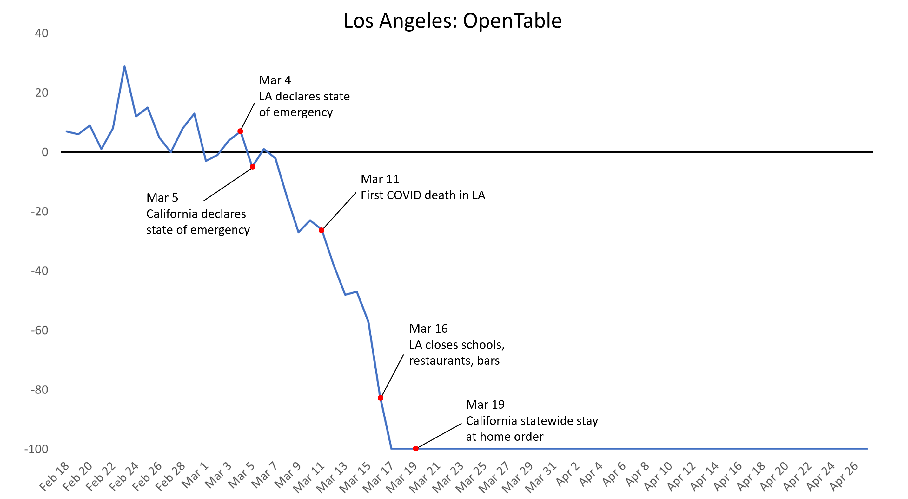

As the debate continues in the US and around the world over whether to lift lockdown restrictions, one important issue that hasn’t received much attention is how people would behave without official measures. [Sweden’s government](https://www.nytimes.com/2020/04/28/world/europe/sweden-coronavirus-herd-immunity.html), for example, has refrained from implementing mandatory lockdown orders, arguing that the Swedish people would practice social distancing anyway.

Do official government lockdown restrictions matter? When did people start practicing social distancing and staying at home? What actions or events drove this change in behavior? Using four sets of publicly-available mobility data (OpenTable, Apple, Citymapper, and Google), I take a close look at trends in movement compared with major events in three US cities: Seattle, New York, and Los Angeles.

&nbsp;  

# The Data

I use four sources of city-level data on mobility leading up to and during the outbreak. These datasets are all freely available for download online as CSV files at the links I’ve included below. Each of them is slightly different and tells us slightly different things. But overall they are remarkably consistent in showing the timing of major turning points for the cities I’ve looked at.

- [OpenTable](https://www.opentable.com/state-of-industry) has data on dining out trends across their sample of 20,000 restaurants. For a given country, state, or city, their data compares each day’s overall restaurant traffic with the same day in the previous year. So a -40 would meant that that day’s restaurant traffic was 40% less than what it was on that same day a year ago. This kind of comparison helps remove seasonal and day of week effects. You can explore trends by region on their website or download their entire dataset as a CSV file.

- [Apple Maps](https://www.apple.com/covid19/mobility) has data on how many users look up directions compared with a baseline number from January 13, 2020. Because this data is relative to a fixed baseline date, there will be seasonal and day of week trends that are not netted out. In addition, because they define their days by Pacific Standard Time, some of the data for regions in other time zones will be shifted slightly. Data is broken out by country, state, and city and also by mode of transport where possible (driving, transit, and walking). In my analysis, I’ve chosen to focus on only on driving data because all three modes are strongly correlated and show similar patterns. You can explore trends by region on their website or download their entire dataset as a CSV file.

- [Citymapper](https://citymapper.com/cmi), an app that gives directions for public transport, has a “mobility index” that shows what percent of a city is “moving” compared to normal. Like the Apple Maps data, Citymapper’s data is based on the volume of requests for directions compared to a baseline of volume over 4 weeks from January 6, 2020 to February 2, 2020. Thus, the data may not net out seasonal effects but appears to net out day of week effects. They define their days slightly differently depending on time zone, so there may be some data that’s split across two consecutive days when the time zones don’t align properly. The entire dataset can be downloaded as a CSV file.

- [Google](https://www.google.com/covid19/mobility/) has data based on the location histories of its users, which is normally used for showing popular times for places in Google Maps. Each day’s volume of estimated visits and lengths of stay per location are compared to a 5-week baseline period from January 3, 2020 to February 6, 2020. Thus, the data nets out day of week effects but not seasonal effects. Google also breaks out their data by location type: retail & recreation, grocery & pharmacy, parks, transit stations, workplaces, and residential. Retail, transit, and workplace data are strongly correlated with each other and inversely correlated with residential data. Grocery and park data seem to follow their own trends. For my analysis here, I’ve focused only on their transit measure, which does a good job of capturing the overall trend. You can get PDF reports on specific countries or cities or download the entire dataset as a CSV file.

There’s plenty of other data out there as well, but more detailed county-level data is usually proprietary. For example, detailed mobility data based on 15 million cell phones from private company Cuebiq was used by the New York Times for their [main article](https://www.nytimes.com/interactive/2020/04/02/us/coronavirus-social-distancing.html) on how social distancing varies with geography and a [follow-up analysis of social distancing by income](https://www.nytimes.com/interactive/2020/04/03/us/coronavirus-stay-home-rich-poor.html). While trends in regions and cities can be [explored on their website](https://www.cuebiq.com/visitation-insights-covid19/), the data itself is not available for download. The same is true for mobility data from private company [Unacast](https://www.unacast.com/covid19/social-distancing-scoreboard), which offers a “social distancing scoreboard.”

There’s also data on official social distancing measures. A group of researchers at Oxford’s Blavatnik School of Government have created an openly available “[Coronavirus Government Response Tracker](https://www.bsg.ox.ac.uk/research/research-projects/coronavirus-government-response-tracker)” that tracks when and which social distancing measures such as school closures and travel bans were implemented. The tracker then aggregates these various measures to produce a composite “stringency index” for each region over time. You can freely download their latest datasets from [their website](https://www.bsg.ox.ac.uk/research/research-projects/coronavirus-government-response-tracker) or from [Github](https://github.com/OxCGRT/covid-policy-tracker).

&nbsp;  

# Seattle

For Seattle, the turning point for social distancing appears to be February 29, marking the start of a sharp downward trend in mobility. February 29 was the day of the first American death from COVID-19, a resident at the Life Care Center of Kirkland nursing home in the Seattle area. That same day, Washington governor Jay Inslee announced a state of emergency. From the OpenTable data, we can see that restaurant traffic began a sharp secular decline starting February 29. This February 29 turning point shows up in the Citymapper, Google, and Apple data as well. There is a day lag in some cases, perhaps due to the timing of the news and other factor, but no other news came out the next day that appears to be driving the change.

Social distancing in Seattle appears to have begun long before official city or state restrictions. On March 4, state and local public health officials recommended but did not require residents of King County, where Seattle is located, to work from home. On March 12, K-12 schools in the Seattle area closed. By March 13, more than 50 restaurants in Seattle had closed but there were still no mandatory restrictions until March 15 when Washington declared a statewide closure of all restaurants and bars. We can see from the OpenTable data that shortly after this, restaurant volumes finished their drop to zero. By the time Washington governor Jay Inslee declared a statewide stay-at-home order on March 23, we can see that movement levels were already at or close to the lowest points they would ever reach.

Social distancing in Seattle also appears to have begun before actions taken by major Seattle employers. On March 4, Microsoft asked its Seattle employees to work from home. On March 5, Amazon, Google, and Facebook joined Microsoft in asking their Seattle employees to work from home. On March 6, the University of Washington announced that all classes were moving online, the first university in the country to do so.

The large number of people affiliated with these organizations and their sizable influence in the Seattle area may have contributed significantly to changing the attitudes of Seattle residents toward the outbreak. But it’s interesting to observe that while their actions may have helped Seattle flatten the curve faster, people were already starting to stay at home almost a week before they were announced.

# New York City

New York City’s turning point appears to be March 7 when Governor Andrew Cuomo declared a state of emergency for New York State. OpenTable shows a slight decline before this, around the time of the first COVID death in the US on February 29 and the first COVID case in New York City on March 1. But after March 7, the decline is significantly steeper. Citymapper and Google Maps transit data also point to March 7 as the start for a secular decline in public transportation volumes. The Apple driving data suggests a similar March 7 turning point for driving as well.

It’s interesting to see that New Yorkers did not seem to be doing much social distancing before March 7. Events such as the first US COVID death and the first COVID case in New York City appear to have had little effect on movement with the exception of going out to restaurants.

It looks like social distancing in New York City did begin well before official lockdown restrictions, including the belated closure of restaurants and bars as well as public schools in New York City on March 16. By the time Gov. Cuomo signed a statewide stay-at-home order on March 20, movement in the city had already dropped close to the lowest levels they would ever reach.

# Los Angeles

The Los Angeles story is a bit more puzzling. Some data suggest a turning point around March 5. On March 4, LA mayor Eric Garcetti along with LA county leaders declared a state of emergency for the city. The next day on March 5, California governor Gavin Newsom declared a state of emergency for California. A March 5 turning point fits best with the Google transit data.

But other data suggest a slightly later turning point, perhaps around March 9. Because most LA residents drive rather than take public transportation, we might want to give more weight to the Apple Maps driving data, which suggests a turning point not around March 5 but around March 9.

As with Seattle and New York City, LA appears to have begun social distancing before official lockdown restrictions were put in place. By the time LA had its first COVID death on March 11, LA residents were already reducing their movement in the city. On March 16, LA closed its public schools, restaurants, bars, theaters, and gyms. By the time California governor Gavin Newsom announced statewide stay-at-home orders, the level of movement in LA was already close to all-time lows.

In an interesting side note, during the outbreak LA went ahead with voting for Super Tuesday on March 3 and with the LA Marathon on March 8. Neither of these major events appears to have affected movement trends significantly.

# All Three Cities Compared

Finally, we can compare all three cities for each of our four datasets. We can see that New York and LA follow fairly similar trends, reflecting their close turning points. Seattle appears to be about a week ahead of both. 

# Conclusion

Ultimately, I find that across these three cities people began social distancing and staying at home long before official government restrictions. By the time full stay-at-home orders were issued, these cities were already close to the lowest levels of movement they would ever reach. Even by the time cities began closing restaurants and schools, there was already significant social distancing.

The turning point for when cities began to practice social distancing does not appear to depend on events such as the first COVID case or the first COVID death in the city. Instead, I believe that the single biggest factor that convinced people to start social distancing was the declaration of a state of emergency, either at the city or the state level. Even though such declarations likely had little direct impact on the day-to-day lives of residents, I believe that the psychological shock factor of hearing in the news that your city or state has declared a state of emergency convinced people to start taking the outbreak seriously and begin limiting activities outside the home.

What does this all mean? On the one hand, this finding suggests that people listen to their governments and that a clear signal from political leaders can have a powerful effect on people’s attitudes and behaviors. Political leadership at the local level matters.

On the other hand, we cannot draw any conclusions from this analysis about whether people would practice social distancing without actual government-imposed restrictions. While people in these three cities did begin social distancing long before official restrictions were in place, the imposition of restrictions such as school and restaurant closures as well as full stay-at-home orders may have helped ensure that everyone was practicing social distancing.

There may be some social distancing “early adopters” who will lead the way without any government requirements. But there may significant numbers of “laggards” and even “resisters” who ultimately have to be forced into compliance with social distancing measures through mandatory government-issued lockdown restrictions.

As states begin to experiment with lifting restrictions, we’ll see whether people venture out into shops and restaurants or remain sheltering in place. The trends should show up in the data.

&nbsp;  
[This article was also published on Medium.](https://medium.com/@kyle.i.chan/were-cities-already-social-distancing-before-the-lockdown-a9de35506676)