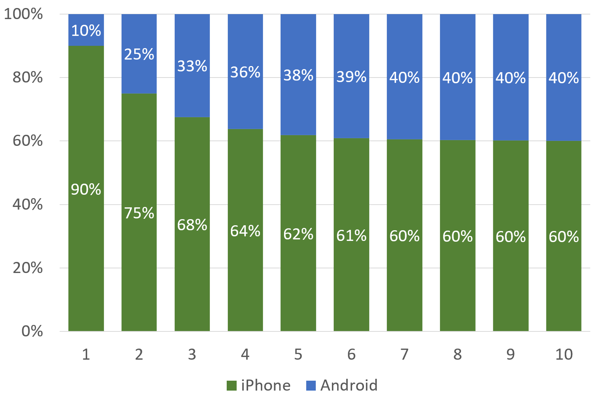

Most explanations of Markov chains dive right into the math and statistics without offering any intuitive sense of the concept. Textbooks and lectures often emphasize precision and efficiency over actual comprehensibility. In this article, I'll try to provide the basic intuition behind Markov chains using a simple example and as little math or statistics as possible. This article is not meant to be comprehensive but rather aims to complement the more formal explanations you see in textbooks and elsewhere.

&nbsp;
## What is a Markov chain?

A Markov chain is a series of events where the probability of something happening depends only on what happened right before it. For musicians, it's like having the success of your next album depend only on the success of your latest album. Whatever happened in the distant past doesn't matter.

Let's think about 4 time periods. In a Markov chain, whatever happens in Time 4 depends only on the situation in Time 3. Anything that happened in Time 1 or Time 2 doesn't really matter for Time 4.

In a Markov chain, the situation in Time 4 only depends on the situation in Time 3. Whatever happened in Time 1 and Time 2 has no direct effect on what happens in Time 4.Why are Markov chains important?

There are two general reasons why we should care about Markov chains.

First, many things in the real world behave sort of like Markov chains. We can think of examples of things where the immediate future mostly depends on the recent past rather than on all of history.

Weather is a common example. If it's rainy today, then there's a decent chance it'll be rainy tomorrow. Tomorrow's weather will probably be like today's weather. Whether it rained or not a month ago doesn't really affect tomorrow's weather forecast. This isn't a perfect example of a Markov chain because we have things like seasons, but it fits pretty well.

Second, Markov chains allow us to reduce complex problems to a set of simple steps that can be easily programmed and run on a computer. When we have a computer execute these same steps thousands of times, we can produce very close answers to problems that we wouldn't be able to solve otherwise. Later, I'll touch on how Markov chains allow us to use a set of machine learning techniques called Markov chain Monte Carlo methods.

So how do Markov chains work? It's helpful to walk through an example.

&nbsp;
## An Example: iPhone vs. Android

Let's think about smartphone users, which we can divide into two types: iPhone users and Android users. These are our possible states. Being an iPhone user is one state. Being an Android user is another state. The full set of possibilities is the state space. In this case, the state space is only made up of two possible states: being an iPhone user or being an Android user.

Let's say each year, everyone buys a new smartphone. You can stick with your current type of smartphone or switch. Let's say users tend to stick with their current type of smartphone but may occasionally switch.

So if you currently use an iPhone, the next phone you buy will probably be another iPhone. Let's say this probability is 80%. But that there's also a chance you'll switch to Android. Let's say this probability of switching is 20%.

And if you currently use an Android phone, you'll probably buy an Android phone again - say with 70% probability - but there's also a chance you'll switch to an iPhone - say with 30% probability.

Probabilities for getting an iPhone or an Android phone next year depending on whether you're an iPhone or Android user this yearEach of these probabilities of staying with your current type of smartphone or switching is called a transition probability. Transition probabilities are "conditional probabilities" where the probability of being an iPhone or Android user in one year depends on ("is conditional on") whether you were an iPhone or Android user the previous year.

All of these transition probabilities put together form a transition matrix. A transition matrix allows us to map out the probabilities for every possible future state- whether you're iPhone user or Android user next year- for each possible current state- whether you're an iPhone user or Android user this year.

We can think about what will happen not just for this year and next but the year after as well.

If you start off as an iPhone user in Year 1, these are your probabilities for being an iPhone user or an Android user in Year 2 and Year 3If we start with an iPhone in Year 1, then in Year 2 we have an 80% chance of having an iPhone again and a 20% of having an Android phone. We can do the same thing again for Year 3, but this time we apply our transition probabilities to our situation in Year 2. If we had an iPhone in Year 2, then in Year 3 we'd have an 80% chance of having an iPhone and a 20% chance of having an Android phone. But if we had an Android phone in Year 2, then in Year 3 we'd have a 30% chance of having an iPhone and a 70% chance of having an Android phone.

We can think about this at the group level across many smartphone users. Let's say our users start off being a mix of 90% iPhone users and 10% Android users. This is called the initial distribution.

If we apply our initial distribution to a group of 100 smartphone users, that means in Year 1 we'd start with 90 iPhone users and 10 Android users. In Year 2, some people will switch and some will stay with their existing smartphone platforms. How many people will switch and how many will stay is determined by the transition probabilities we set earlier.

Of the 90 iPhone users:
* 80% of them will stay with an iPhone, so that means 72 iPhone users
* 20% will switch to Android, so that means 18 Android users

Of the 10 original Android users:
* 70% will stay with Android, so that means 7 Android users
* 30% will switch to an iPhone, so that means 3 iPhone users

So in Year 2, if we add these all up, we end up with:
* 75 iPhone users
* 25 Android users

For Year 3, we would apply our same transition probabilities again but to Year 2 instead. A percentage of our iPhone users in Year 2 would stay iPhone users in Year 3 (80%) while the rest would switch to Android (20%). A percentage of our Android users in Year 2 would stay Android users in Year 3 (70%) while the rest would switch to using an iPhone (30%). For Year 3, it doesn't matter whether you were originally an iPhone user back in Year 1. All that matters is whether you were an iPhone user in Year 2.

For Year 4 and Year 5 and every year after that, we'd apply our transition probabilities to the distribution of smartphone users in the previous year. We can do this for as many years as we'd like.

&nbsp;
## Stationary Distributions

If we keep going for many years, the proportion of iPhone users and Android users will eventually converge to a steady-state equilibrium. You can see below that after around 6 years, our group of users ends up stabilizing at around 60% iPhone users and 40% Android users. After 100 years or 1,000 years or a million years, our proportion of iPhone and Android users basically stays the same.

When we look at what happens to a distribution over the very long run, we're finding the limiting distribution. And when our limiting distribution converges to something stable, we call this a stationary distribution (it's also called an invariant distribution or an equilibrium distribution). So for our example, the 60/40 split of iPhone users and Android users over the long run is our stationary distribution.

It turns out that the exact proportion of iPhone and Android users that we converge to over the long run depends only on our transition probabilities. If we change any of our transition probabilities, that would change our stationary distribution. For example, if we increased our probability that an iPhone user this year sticks with an iPhone again next year from 80% to 90%, we would end up with a 75/25 split of iPhone users vs. Android users in the long run. These long-run stationary distributions can be found mathematically using linear algebra.

It turns out that our initial distribution doesn't matter in the long run. It doesn't matter if we started out with 90% iPhone users and 10% Android users or if we started out with 50% iPhone users and 50% Android users. The amount of time it would take might vary, but eventually we would arrive at the same steady state 60/40 split as long as our transition probabilities remained the same.

&nbsp;
## Ergodic Markov Chains

Do all Markov chains converge in the long run to a single stationary distribution like in our example? No. It turns out only a special type of Markov chains called ergodic Markov chains will converge like this to a single distribution. An ergodic Markov chain is a Markov chain that satisfies two special conditions: it's both irreducible and aperiodic. I'll explain what these mean.

**Condition 1: Irreducible**

First, we have to be able to get be able to get from any one state to any other state eventually. We can never get permanently stuck in one state or a set of states. When this is true, then the Markov chain is said to be irreducible.
This is true for our smartphone example. If you're an iPhone user, you can become an Android user next year or sometime in the future. And if you're an Android user, you can become an iPhone user next year or sometime in the future. If we had set up our example differently so that once you became an iPhone user you could never switch to having an Android phone, then our Markov chain would no longer be irreducible.
Keep in mind that for a Markov chain to be irreducible, you don't have to be able to reach every state right away. It could be the case that it takes several steps to reach a certain state. But the important thing is that eventually you could reach any state with enough steps.

**Condition 2: Aperiodic**

Second, we can't get stuck cycling back and forth between the same set of states at regular intervals. In other words, our Markov chain must be aperiodic.

It's helpful to first explain what a periodic Markov chain is. A Markov chain is periodic when we keep ending up at the same state every 2 or 3 or more regular intervals of time. For our smartphone example, let's go back to thinking only about a single user. And this time, let's say that each year you definitely switch which type of smartphone you use (so your probability of switching is 1). So if you start with an iPhone in Year 1, then you'll have an Android phone in Year 2, and then an iPhone again in Year 3.

An example of a periodic Markov chain. If we switch phones every year with 100% probability, then we end up with an iPhone every odd year and an Android phone every even year.You can quickly see that in odd years, you'd definitely have an iPhone and in even years you'd definitely have an Android phone. In this case, your Markov chain is periodic because you keep cycling back and forth between an iPhone and an Android phone at a fixed interval of time - in this case, every 2 years.

But in our original smartphone example with our various transition probabilities, we would never end up cycling between an iPhone and an Android with such regularity. While we do go back and forth between our two possible states - iPhone and Android - we don't do this at regular time intervals. In other words, it is not the case that every 2 years or every 3 years you end up with an iPhone. There is no regular pattern where you could predict that in every odd or even year or every 3 or 5 years you would have an iPhone. Because there is no time-based pattern, this Markov chain is said to be aperiodic.

When these two conditions are satisfied - that is, when our Markov chain is both irreducible and aperiodic - then we can say our Markov chain is ergodic. And if we put all this together, we have the ergodic theorem, which says that any Markov chain that's ergodic converges in the long run to a single stationary distribution regardless of our initial distribution. In other words, if you run one of these special types of Markov chains over many time periods, you'll get closer and closer to a certain distribution regardless of how you started.

We can see this is the case for our group-level example of smartphone users. Because of the way we set up our transition probabilities (e.g., an iPhone user this year has an 80% of being an iPhone user next year), we created a Markov chain that happened to be ergodic. And because our Markov chain was ergodic, we could apply the ergodic theorem and know in advance that we would eventually converge to a certain mix of iPhone and Android users in the long run. The ergodic theorem allowed us to know this without ever having to play out our Markov chain over multiple years.

## Markov Chain Monte Carlo

Why should we care about the ergodic theorem? Because it's the basis for a powerful type of machine learning techniques called Markov chain Monte Carlo methods. Markov chain Monte Carlo methods (often abbreviated as MCMC) involve running simulations of Markov chains on a computer to get answers to complex statistics problems that are too difficult or even impossible to solve normally.

The ergodic theorem is fundamental to using Markov chain Monte Carlo methods because it ensures convergence. As long as we use ergodic Markov chains when we set up our Markov chain Monte Carlo simulation, then we can be sure that the data points generated by our simulation will indeed converge to a single distribution. But more on Markov chain Monte Carlo methods in another article.

&nbsp;  
[This article was also published on Medium.](https://towardsdatascience.com/the-intuition-behind-markov-chains-713e6ec6ce92)