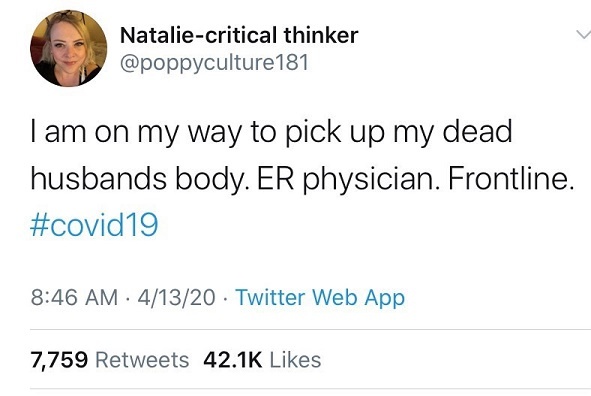

Key points:

- Fake Twitter accounts have recently been using posts about fake coronavirus deaths to attract attention with some high-profile successes, even tricking Beto O’Rourke’s official account into replying.
- Many of these fake Twitter accounts target American liberals, using liberal hashtags like #resist and #VoteBlueNoMatterWho, posting liberal news stories, and criticizing Trump.
- These recent posts about fake coronavirus deaths show how adept — and how reprehensible — these Twitter bots have become in their efforts to attract attention, gain followers, and spread fake news.
- I provide some examples of fake Twitter accounts and an analysis of 15,000 Twitter profiles.

   
# A Strange Discovery

Recently, I had been noticing a number of posts on Twitter from users who had lost loved ones to COVID-19. One tweet that was “liked” by a doctor I follow caught my eye. This tweet is no longer available, but I managed to grab a screenshot:

Several things about this tweet seemed off. It seemed strange that someone would be on Twitter immediately after losing their husband. I also wondered whether a hospital would really allow someone to “pick up” the body of a family member who had just died of COVID-19. In general, the language simply sounded too crude.

As I read through the comments, I found a few skeptics amidst the many expressions of condolence. Some people had gone through this user’s previous tweets and discovered strange inconsistencies. I also went back through her previous tweets and thought the English sounded strange. A number of users began to report her, and while I was still reading through her previous tweets Twitter suspended the account. I did manage to grab a screenshot of the Twitter profile:

Several shocking thoughts began to cross my mind. Had I stumbled across a bot or troll? Were they using fake coronavirus deaths to attract attention and gain followers? Could people really be stooping down to this level?

I managed to capture one other particularly odd tweet from this same account before it was removed. This tweet had attracted significant attention because it played on people’s outrage over violations of social distancing rules. The English seemed strange here as well. Note the use of the word “proclaimed.”

   
# More Fake Coronavirus Deaths

As I dug in further, I discovered a vast web of interconnected fake Twitter accounts targeting American liberals, some of which used fake news about the death of a loved one from COVID-19 to attract attention.

Here’s another example of a fake post that former presidential candidate Beto O’Rourke’s official account actually replied to:

<blockquote class="twitter-tweet">
My mother just died of the Coronavirus.
&mdash; Katherine Morgan (@KatherineM213) <a href="https://twitter.com/KatherineM213/status/1249428825865424897?ref_src=twsrc%5Etfw">April 12, 2020</a></blockquote> 

<blockquote class="twitter-tweet">
I am sorry Katherine. There is a lot of love for you from all of us. Always. Sending you strength.
&mdash; Beto O&#39;Rourke (@BetoORourke) <a href="https://twitter.com/BetoORourke/status/1249438353176629250?ref_src=twsrc%5Etfw">April 12, 2020</a></blockquote> 

&nbsp;  
Earlier, this same user had posted this strange tweet:

<blockquote class="twitter-tweet">
My mom is having CPR done.
&mdash; Katherine Morgan (@KatherineM213) <a href="https://twitter.com/KatherineM213/status/1249424432659038211?ref_src=twsrc%5Etfw">April 12, 2020</a></blockquote> 

&nbsp;  
It turns out [this Twitter account](https://twitter.com/KatherineM213) is entirely dedicated to promoting Beto O’Rourke, with thousands of retweets of campaign footage, news, and photos of the former presidential candidate:

&nbsp;  
# Real vs. Fake Twitter Accounts

I knew I had to be careful given the [number](https://twitter.com/shomaristone/status/1245755620915130368) of [tragically](https://twitter.com/monicacbell/status/1248984672144678915) [real](https://twitter.com/aliarouzi/status/1248326350852718595) [posts](https://twitter.com/iamritu/status/1249692829577818120) about loved ones dying from COVID-19. I ran the risk of mistakenly accusing someone who lost a loved one of lying. Some of the Twitter accounts I came across looked immediately suspicious while others were more ambiguous.

One heuristic I used was whether the user posted original tweets or mostly just retweeted other posts. I found that fake accounts generally had a significantly lower rate of original tweets and mostly just retweeted political news. Here’s a comparison of five real Twitter accounts and five fake ones:

But this is an imperfect rule of thumb. Some real users actually tend to retweet more while some fake users post many original tweets. In lieu of [creating an AI algorithm to identify fake accounts](https://www.protocol.com/facebook-machine-learning-fake-accounts), I had to resort to manually reading through tweets. Some accounts were clearly fake, such as this one, which

[Maureen Kelly 🆘✌️✊🌊❄️ (@maureen1227) | TwitterThe latest Tweets from Maureen Kelly 🆘✌️✊🌊❄️ (@maureen1227). Union member @machinistsUnion. Fighting for labor rights…twitter.com](https://twitter.com/maureen1227)

This fake account actually started to retweet my posts, showing how quickly the bot algorithm was working:

[HalleThe latest Tweets from Halle (@HalleEva). STOP tRump #NoWar #Atheist #FamiliesBelongTogether #ClimateChange #GretaPower…twitter.com](https://twitter.com/HalleEva)

But others were more ambiguous. I’m still not sure about this one:

<blockquote class="twitter-tweet">
I can’t believe the amount of people who are trying to shame me (non-followers and other trolls,) because I shared my mom’s death on twitter. You are heartless, cruel and disgustingly horrible monsters. Quote tweeting my mom’s photo and saying awful things.
&mdash; 🤬Marilyn🤬 (@twitweeting) <a href="https://twitter.com/twitweeting/status/1250095771229106177?ref_src=twsrc%5Etfw">April 14, 2020</a></blockquote> 

Or this one:

<blockquote class="twitter-tweet">
I don’t get personal on here very often, I lost my sister Lory yesterday. I’m going to take a little break to grieve. Be well and let your loved ones know that you care about them💔Rest In Peace, sis.â¤ï¸ğŸ™ğŸ»ğŸ’ <a href="https://t.co/8KZaY64TL2">pic.twitter.com/8KZaY64TL2</a>
&mdash; ğ•·ğ–Šğ–˜ğ–‘ğ–𖊠💙 (@lezleedee2) <a href="https://twitter.com/lezleedee2/status/1250174195197259777?ref_src=twsrc%5Etfw">April 14, 2020</a></blockquote> 

&nbsp;  
# Analyzing Fake Twitter Accounts

Using the Twitter API, I downloaded the Twitter profiles of 15,000 followers of several fake accounts. While I didn’t check every profile, the vast majority appear to be fake. Here’s a sample list of names and profile descriptions:

You can already see some patterns in the profiles, many of which have a strongly liberal bend.

Next, I analyzed word frequencies across these Twitter profiles and found a high number of liberal keywords, including the hashtags #resist, #VoteBlueNoMatterWho, and #FBR (“[Follow Back Resistance](https://medium.com/@gregory.boyce/follow-back-resistance-fbr-9cf6ae6d8844)”). The emoji that appears on this chart is actually a [blue wave](https://abc7news.com/politics/2018-election-what-is-a-blue-wave-/4550049/) and shows up in many of the fake Twitter accounts I found.

Here’s the same data as a word cloud:

I also noticed several other distinctive features of these Twitter profiles:

- No direct messages: Many profiles said “no DMs” or direct messages, probably to prevent real users from finding out that these accounts belong to bots.
- Cancer: A number of these users claimed to have cancer or be cancer survivors. This is an interesting tactic because it attracts attention while at the same time deflecting criticism — who would dare attack someone with cancer?
- Animals: Many profiles professed a love for cats or dogs. Given how much pet-owners obsesses over animals, this one makes perfect sense.

&nbsp;  
# What’s Going On?

I think American liberals tend to see fake news on social media as a problem among Republicans. But we have to understand that this is a [problem](https://blogs.scientificamerican.com/beautiful-minds/liberals-and-conservatives-are-both-susceptible-to-fake-news-but-for-different-reasons/) for [liberals](https://www.aeaweb.org/articles?id=10.1257/jep.31.2.211) as well. Russia’s efforts to interfere with the 2016 US elections involved [targeting African-Americans on social media](https://www.nytimes.com/2018/12/17/us/politics/russia-2016-influence-campaign.html) through issues such as the Black Lives Matter movement. This is part of a longer historical pattern that stretches back to the [Soviet Union’s campaign to support the American civil rights movement](https://www.theatlantic.com/international/archive/2017/10/russia-facebook-race/542796/).

Using liberal-sounding social media accounts is a great way to bait American liberals for two reasons: 1) emotions, especially outrage, are likely to get ahead of reasoning when it comes to partisan issues, and 2) Trump and the Republicans are indeed speaking and acting in ways that were previously unthinkable.

These same conditions now apply to the coronavirus pandemic, which presents another great opportunity for fake Twitter accounts to bait American liberals. As with political news, emotions are likely to cloud our judgment when it comes to the pandemic. See the example at the beginning of this piece where Twitter users eagerly rushed to condemn an alleged violation of social distancing rules. And as with political news, real things are happening during the pandemic that were previously unthinkable. These factors make us more susceptible to fake news about the coronavirus.

That fake social media accounts have resorted to posting about fake coronavirus deaths marks a new low. But the number of people who are falling for these fake posts, including users who would normally be more discerning, marks a new high for the ability of these fake accounts to reach a broader audience. Fake news can be easy to spot when it comes from the “other side.” But when fake news [aligns with our existing beliefs](https://www.psychologytoday.com/us/blog/science-choice/201504/what-is-confirmation-bias), even savvy users can fall victim to these efforts.

------

If you want to check out more of these fake accounts, I’ve begun to assemble a [list of fake accounts on Twitter](https://twitter.com/i/lists/1250047523756048390). If you find other interesting examples of fake accounts, especially ones that post about fake coronavirus deaths, please let me know through Twitter: [@kyleichan](https://twitter.com/kyleichan).

[This post was originally published on Medium.](https://medium.com/@kyle.i.chan/fake-coronavirus-deaths-on-social-media-target-liberals-b761c7ad4fe0)